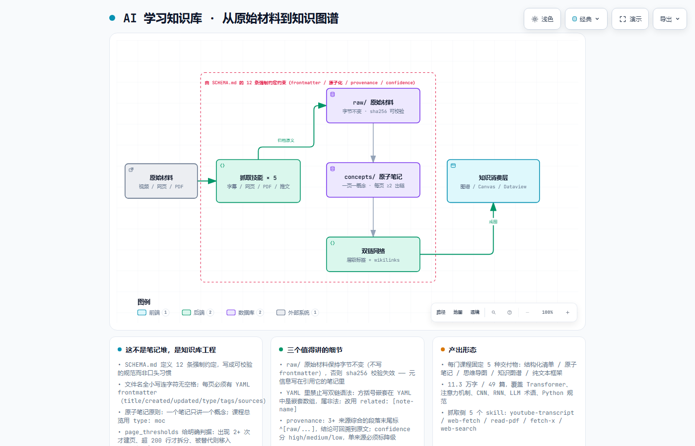

# AI 学习知识库 · Obsidian Wiki

> 一个按**工程规范**组织的个人知识库：49 篇原子笔记 / 11.3 万字，
> 覆盖 Transformer、注意力机制、CNN、RNN、LLM 术语、Python 规范。
>
> 重点不是"我记了多少笔记"，而是**这套知识是怎么被结构化、可追溯、可自动生产的**。

外部材料（视频 / 网页 / PDF / 推文）→ 抓取 → 归档原文 → 提炼原子笔记 → 建双链 → 成图谱。

---

## 一、这不是笔记堆，是知识库工程

多数人的 Obsidian 用久了会变成一堆散笔记：命名混乱、没有元信息、链接全靠感觉、过时的内容不敢删。

这个库的第一份文件不是笔记，是 [`SCHEMA.md`](SCHEMA.md)——一份**可校验的规范**，定义 12 条强制约定：

| 类别 | 约定 |
|---|---|
| 命名 | 文件名全小写、连字符、无空格 |
| 元信息 | 每页必须有 YAML frontmatter：`title` / `created` / `updated` / `type` / `tags` / `sources` |
| 链接 | 双链语法，**每页至少 2 个出链** |
| 标签 | 层级制（如 `python/basics`），新增标签必须先加进 taxonomy |
| 原子性 | **一个笔记只讲一个概念**；课程总览用 `type: moc` |
| 溯源 | 3+ 来源综合的段落末尾标 `^[raw/...]` |
| 置信度 | `high` / `medium` / `low` 三级，opinion-heavy 或单来源**必须标降级** |
| 原始材料 | 一律归档到 `raw/`，**禁止删除** |
| 变更 | 更新时 bump `updated`，所有动作记入 `log.md` |

还有一份**页面创建判据**（`page_thresholds`），把"该不该建一页"变成规则而不是感觉：

```
create       出现 2+ 次，或属于核心主题
dont_create  仅一次提及的细节
split        超过 200 行
archive      被完全替代 → 移入 _archive/
```

---

## 二、架构



> 可缩放 / 可导出 SVG 的交互版本：[`docs/architecture.html`](docs/architecture.html)
> 图源规格：[`docs/architecture.json`](docs/architecture.json)

---

## 三、三个值得讲的细节

这三条都是**踩过之后写进规范**的，不是抄来的最佳实践。

### 1. `raw/` 的原始材料必须保持字节不变

字幕、转录、网页存档一旦落进 `raw/`，就**不再修改**，也不写 frontmatter。

原因：原始材料的价值在于"可校验"。给它加 YAML 头就改了字节，`sha256` 失效，
将来无法证明"这篇笔记确实是从这份材料来的"。

**那元信息写在哪？** 写在引用它的那篇笔记的 frontmatter 里。
**原始材料只负责"是什么"，笔记负责"关于它的信息"。**

### 2. YAML 里不能写双链语法

Obsidian 的双链是双方括号。但 YAML 里 `[a, b]` 是数组——

```yaml
related: [[note-a]]        # ❌ 方括号嵌套，YAML 解析为嵌套数组，非法
related: [note-a, note-b]  # ✅ 用普通列表写
```

这个坑不写下来，每次都会犯。所以它进了 SCHEMA。

### 3. 结论要能回到原文

`provenance` 规则：由 3 个以上来源综合得出的段落，末尾必须标 `^[raw/.../source.md]`。

`confidence` 三级的用意是**区分确定性**：
- `high` = 多个独立来源一致
- `medium` = 单来源但可信
- `low` = 观点性内容 / 有争议

**把"我不确定"标出来，比假装确定更有用。**

---

## 四、知识是怎么被生产出来的

### 抓取侧：5 个 skill

见 [`copilot/skills/`](copilot/skills/)：

| skill | 作用 |
|---|---|
| `copilot-youtube-transcript` | 抓 YouTube 字幕 |
| `copilot-web-fetch` | 抓网页正文 |
| `copilot-read-pdf` | 读 PDF |
| `copilot-fetch-x` | 抓 X / 推文 |
| `copilot-web-search` | 网络检索补充 |

每个 skill 都带 `.cmd` / `.ps1` / `.sh` 三平台脚本，不依赖特定操作系统。

### 生产侧：强制流程

配套的 skill 流程把「一份原始材料 → 一套知识结构」固定下来，**每门课程固定交付 5 种产物**：

1. 结构化清单（层级 + 关联）
2. 原子笔记（每个核心概念一页）
3. 思维导图笔记（mermaid mindmap）
4. 知识图谱笔记（mermaid graph，或生成独立 HTML 力导向图）
5. 纯文本全要素框架（框线版，放 MOC）

已生成的图谱产物就在本仓库：
- [`knowledge-graph.html`](knowledge-graph.html) —— 深色主题力导向图，可交互
- [`知识地图.canvas`](知识地图.canvas) —— Obsidian Canvas 全景地图，节点可直接跳转笔记

---

## 五、目录结构

```
ai-learning-wiki/
├── SCHEMA.md              # ← 知识库规范（12 条约定 + 判据 + 交付物定义）
├── index.md               # 总索引
├── log.md                 # 变更日志（append-only）
├── knowledge-graph.html   # 知识图谱可视化（力导向图）
├── 知识地图.canvas         # Obsidian Canvas 全景地图
├── concepts/              # 原子笔记（27 篇）
│   ├── attention-mechanism.md
│   ├── transformer-architecture.md
│   ├── rnn-architecture.md   cnn-architecture.md
│   ├── neural-network-basics.md
│   ├── llm-terms-100.md
│   ├── python-*.md           pep8-style-guide.md
│   └── ...
├── raw/                   # 原始材料（字节不变）
│   └── transcripts/
├── queries/               # 复用查询
├── Tags/                  # 标签体系
├── copilot/skills/        # 5 个抓取 skill + 5 个 Obsidian 能力 skill
└── docs/architecture.*    # 架构图（本 README 引用）
```

---

## 六、怎么用这个库

1. 装 Obsidian，把本目录作为 vault 打开
2. 启用三个核心插件（见 SCHEMA 的 `required_plugins`）：
   - `dataview` —— 用查询动态生成索引
   - `obsidian-enhancing-mindmap` —— 思维导图
   - `canvas` —— 核心插件，用于知识地图
3. 打开 `knowledge-graph.html` 看知识图谱；打开 `知识地图.canvas` 看主题聚类

> 本仓库**不含** `.obsidian/` 插件二进制与本地向量索引（`.smart-env/`），
> 那些是本地环境产物，按上面三步自己装即可。

---

## 七、已知边界（诚实写在这里）

1. **规模不大**：49 篇 / 11.3 万字。真正的知识库应该是数千篇量级，
   当前主要是 AI/ML 入门到进阶这一段。
2. **主题集中在 AI 学习**，没有跨领域（如业务、管理）。
3. **知识图谱是静态生成的 HTML**，不是实时更新的。新增笔记后需要重新生成。
4. **`provenance` 规则靠自觉执行**，没有工具强制校验——这是规范类设计的通病。
5. **没有笔记质量评估**。SCHEMA 能保证"格式合规"，
   但保证不了"内容正确"。两者是不同的问题。

---

## License

MIT（笔记内容采用 CC BY-NC-SA 4.0）
