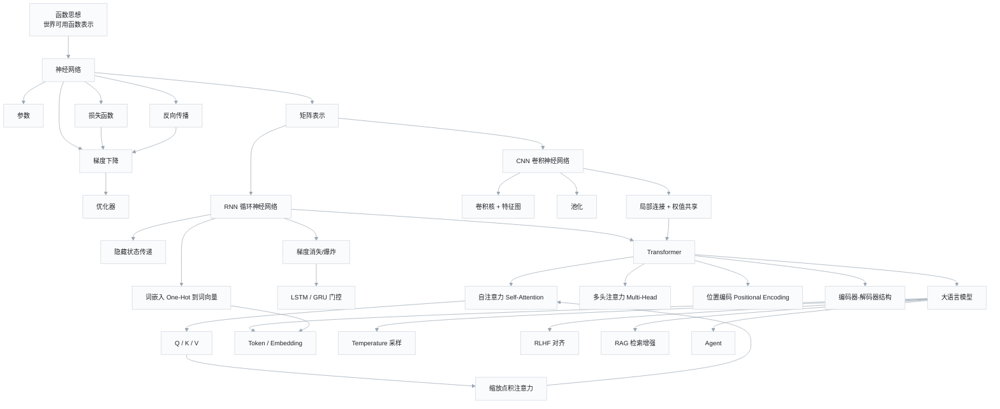

# AI 知识体系 — 知识图谱

> 来源：闪客《一小时从函数到 Transformer》（B站 BV1NCgVzoEG9）
> 返回总览：[[ai-learning-path]]

## 关联笔记

- [[ai-learning-path]] — 学习路径总览
- [[neural-network-basics]] — 函数、参数、损失、梯度下降、反向传播
- [[cnn-architecture]] — 卷积核、池化、权值共享
- [[rnn-architecture]] — 词嵌入、LSTM/GRU、梯度消失
- [[transformer-architecture]] — 编码器-解码器、位置编码、多头注意力
- [[attention-mechanism]] — Q/K/V、缩放点积、掩码注意力
- [[llm-terms-100]] — 大模型 100 个术语
- [[one-hour-function-to-transformer]] — 原始讲稿复刻
