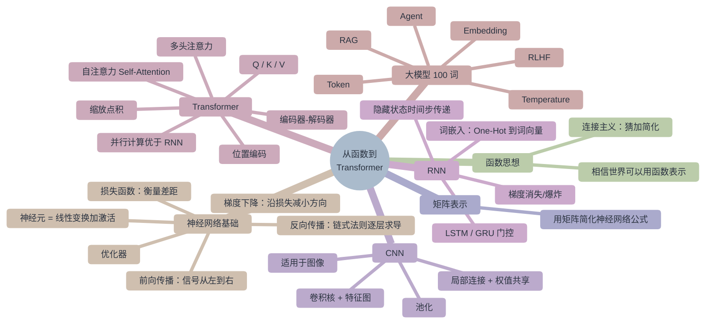

# AI 知识体系 — 思维导图

> 返回总览：[[ai-learning-path]] ｜ 图谱版：[[ai-knowledge-graph]]

## 关联笔记

- [[ai-learning-path]] — 分阶段学习路径
- [[ai-knowledge-graph]] — 同一内容的知识图谱版本
- [[one-hour-function-to-transformer]] — 完整讲稿
- [[neural-network-basics]] / [[cnn-architecture]] / [[rnn-architecture]] / [[transformer-architecture]] / [[attention-mechanism]] / [[llm-terms-100]]
