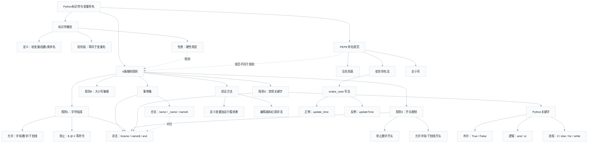

# Python标识符与变量命名 — 知识图谱

> 概念关联网络（graph TD）。返回总览：[[python-identifiers-naming]]

## 关联

- [[python-identifiers-naming]] — 课程总览
- [[python-identifiers-mindmap]] — 同一内容的思维导图版本
- [[python-identifier]] / [[python-naming-rules]] / [[python-keywords]] / [[pep8-style-guide]] / [[snake-case-naming]]
