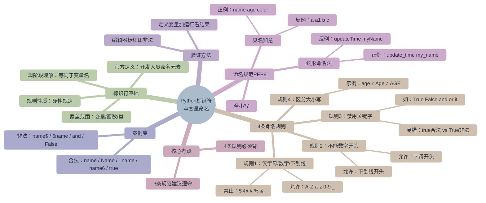

# Python标识符与变量命名 — 思维导图

> 阅读模式下由 Enhancing Mindmap / Obsidian 内置 mermaid 渲染。
> 返回总览：[[python-identifiers-naming]]

## 关联

- [[python-identifiers-naming]] — 课程总览
- [[python-identifiers-graph]] — 同一内容的知识图谱版本
- [[python-identifier]] / [[python-naming-rules]] / [[python-keywords]] / [[pep8-style-guide]] / [[snake-case-naming]]
