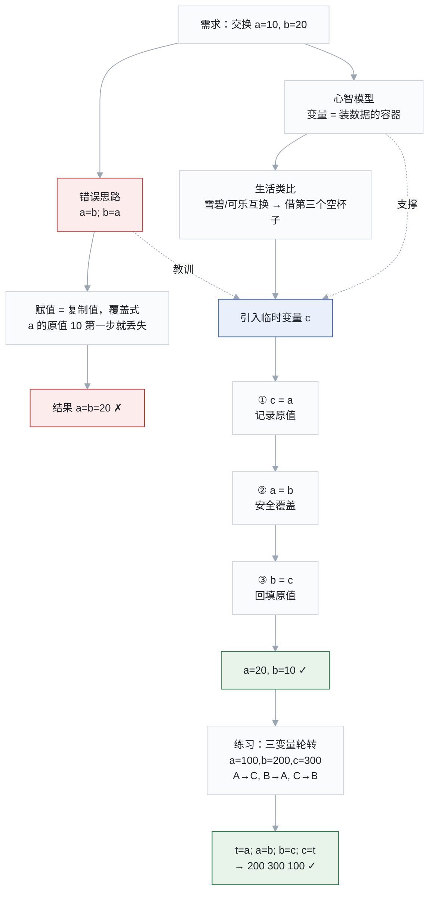

# Python变量交换案例 — 知识图谱

> 阅读模式下由 mermaid 渲染（graph TD）。
> 返回总览：[[python-variable-swap]]

## 节点与笔记的对应

- 错误思路 → [[variable-swap-direct-assignment-trap]]
- 临时变量三步法 → [[temp-variable-swap]]
- 三变量轮转 → [[three-variable-swap-exercise]]
- 容器心智模型 → [[python-identifier]]
