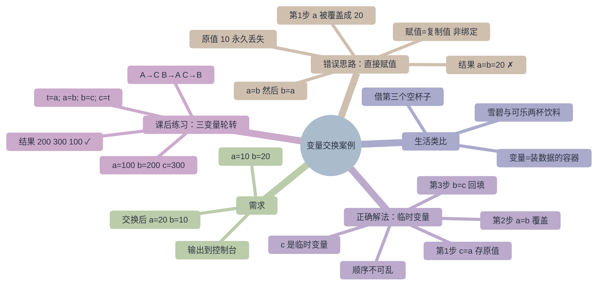

# Python变量交换案例 — 思维导图

> 阅读模式下由 Enhancing Mindmap / Obsidian 内置 mermaid 渲染。
> 返回总览：[[python-variable-swap]] ｜ 知识图谱版：[[python-variable-swap-graph]]

```mermaid
%%{init: {"theme": "base", "themeVariables": {"primaryColor": "#fafbfc", "primaryTextColor": "#2b3340", "primaryBorderColor": "#cfd6df", "lineColor": "#a8b3bf", "fontFamily": "-apple-system, Segoe UI, PingFang SC, Microsoft YaHei, sans-serif", "fontSize": "13px"}, "themeCSS": ".mindmap-node .background{fill:#ffffff !important;stroke:#cfd6df !important;stroke-width:1px !important}.mindmap-node.section-0 .background{fill:#eef4fb !important;stroke:#b6cad9 !important}.mindmap-node.section-2 .background{fill:#fafbfc !important}.edge{fill:none !important;stroke:#a8b3bf !important;stroke-width:1.3px !important}.edge.section-edge-0{stroke:#7a8a99 !important;stroke-width:1.6px !important}.text-inner-tspan,.text-outer-tspan{fill:#2b3340 !important;font-weight:500 !important}.mindmap-node{padding:6px}"}}%%
mindmap
  root((变量交换案例))
    需求
      a=10 b=20
      交换后 a=20 b=10
      输出到控制台
    错误思路：直接赋值
      a=b 然后 b=a
      第1步 a 被覆盖成 20
      原值 10 永久丢失
      结果 a=b=20 ✗
      赋值=复制值 非绑定
    生活类比
      雪碧与可乐两杯饮料
      借第三个空杯子
      变量=装数据的容器
    正确解法：临时变量
      第1步 c=a 存原值
      第2步 a=b 覆盖
      第3步 b=c 回填
      c 是临时变量
      顺序不可乱
    课后练习：三变量轮转
      a=100 b=200 c=300
      A→C B→A C→B
      t=a; a=b; b=c; c=t
      结果 200 300 100 ✓
```
